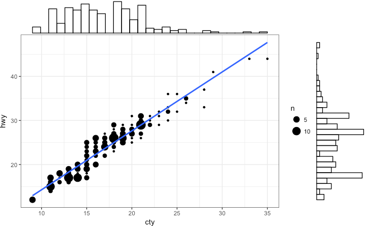
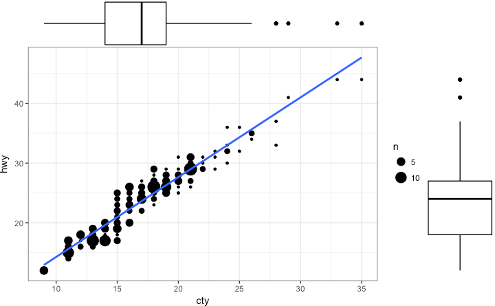
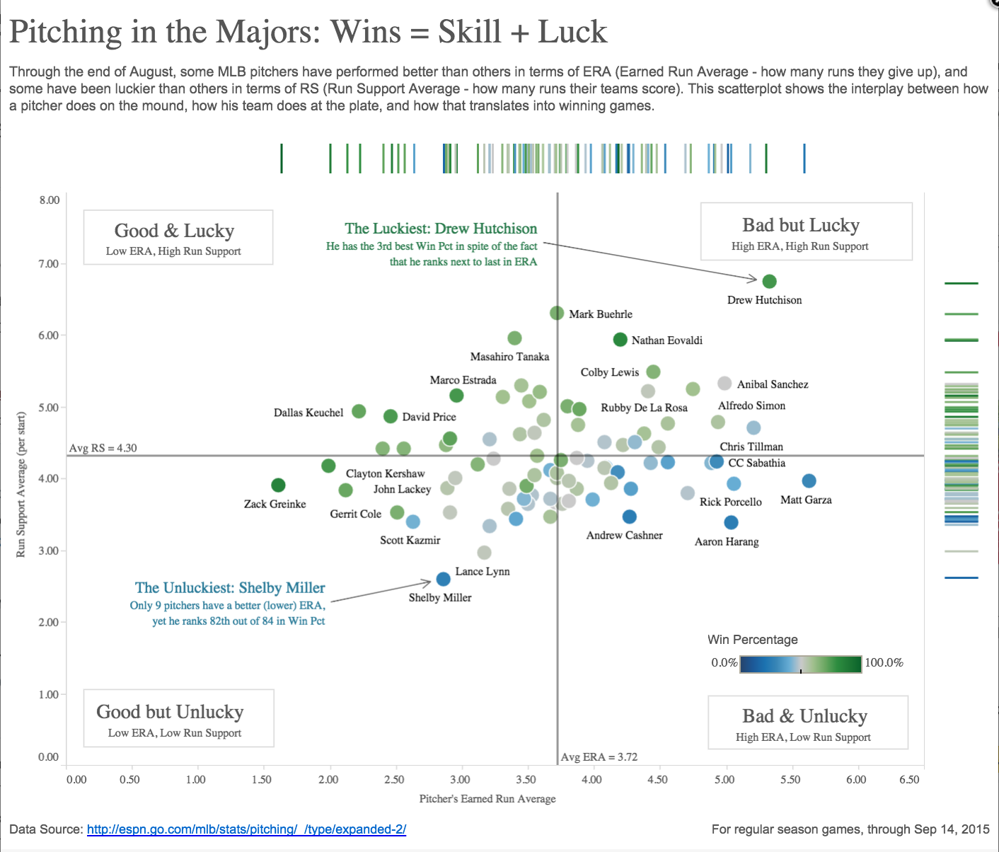
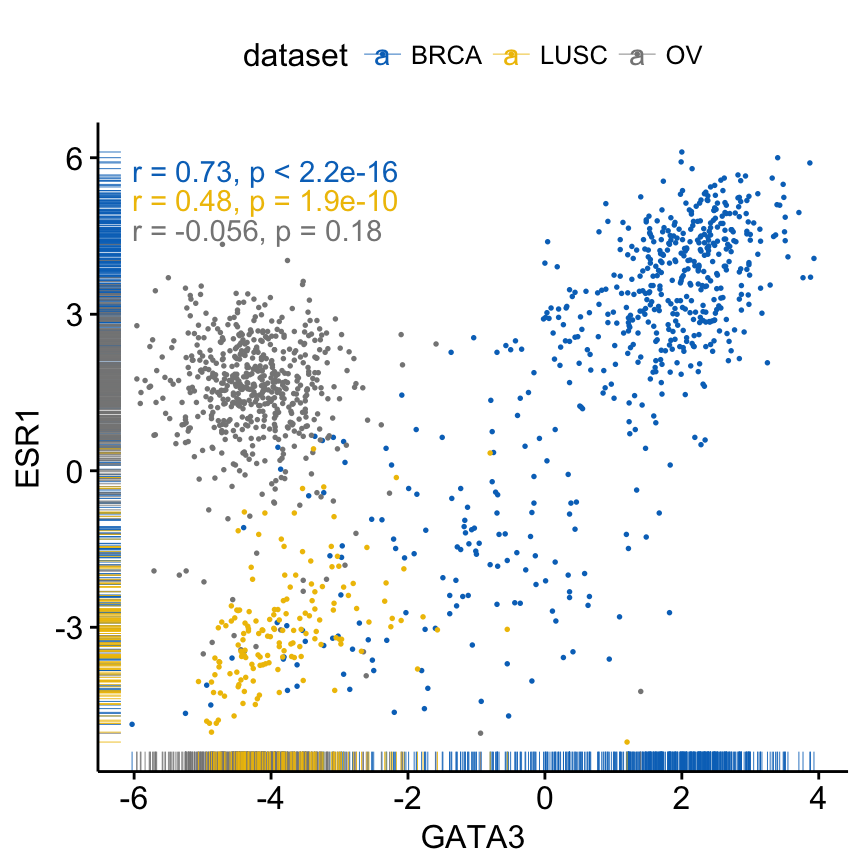
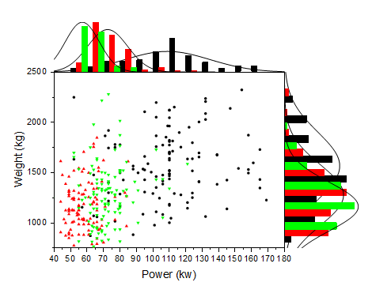
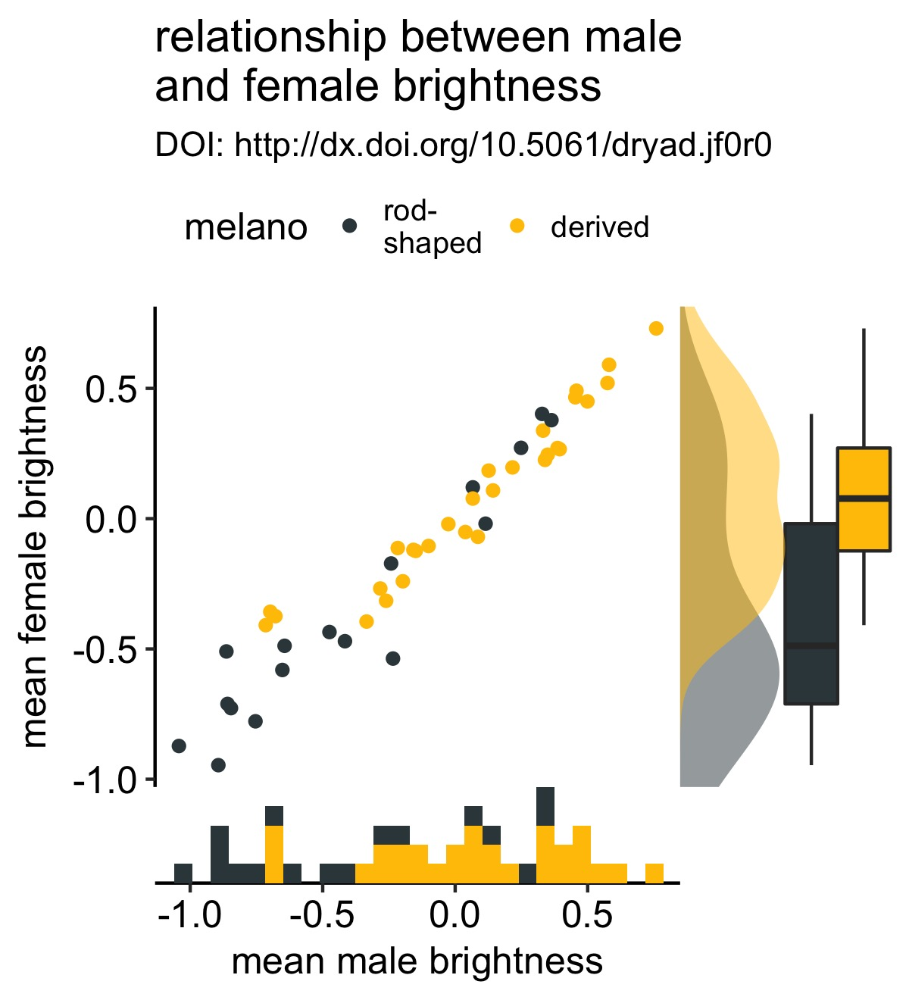
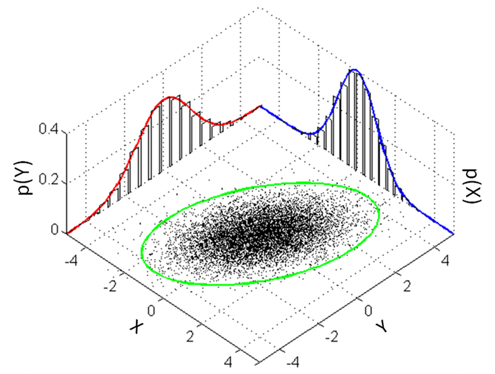
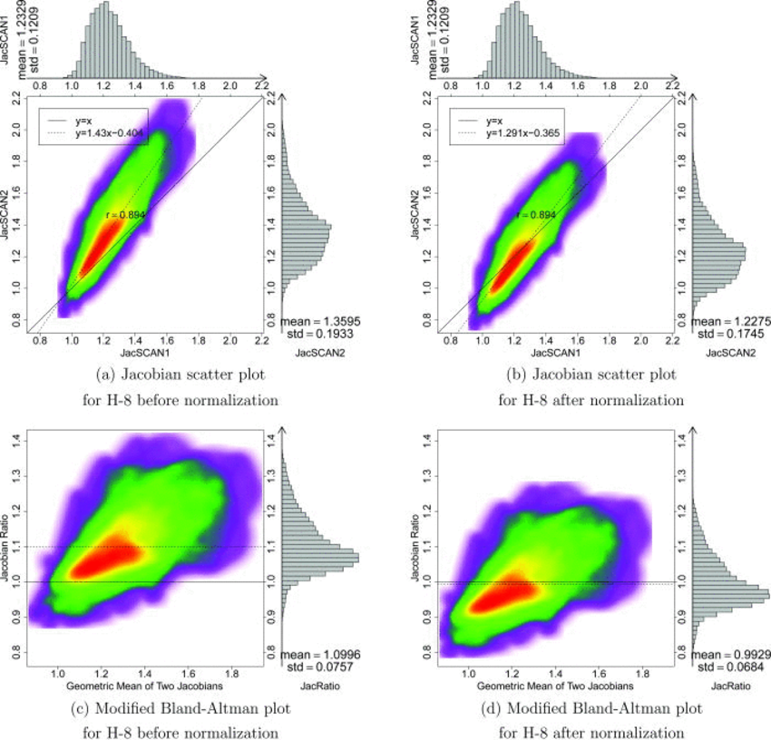
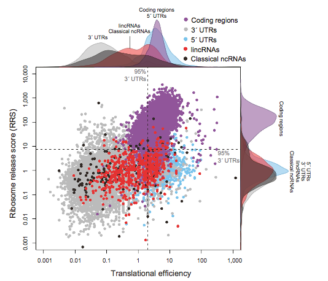

# ChartStudy---MarginalPlot

Typically, a marginal plot actually utilizes the margins of a scatterplot to provide timely and important information about the initial data [1].

## Alternative names

* Stuffed-Crust Charts : refering to the extra information given on each axis of the plot.

## Description

A marginal plot visualization adds some extra data for each dimension of the dataset. On the graph below, more information can be be given on the distribution of each attribute depending on Iris species. It allows to display useful data in addtion to a simple scatter plot, without overloading the visualization.

<table border="0">
  <tr>
    <td>
      
    </td>
  </tr>
  <tr>
    <td>
      Data visualization for Iris dataset with a marginal plot
    </td>
  </tr>
</table>

## Historical/famous Examples

Marginal Plots are quite a marginal way of plotting data.  I was not able to find particularly famous nor historically significant marginal plots.

## Comments: possible variations

There are as many variations as there are visualization for one dimension arrays. Those visualization are histograms, Box-and-Whisker-Plots, hash lines, and so forth. Here are a few examples.

### Scatterplot with Marginal Histograms
Most popular type of 1-D visualization, histograms allows a quick preview of discretized spectrum of data.

<table border="0">
  <tr>
    <td>
      
    </td>
  </tr>
  <tr>
    <td>
      Scatterplot with Marginal Histograms [6]
    </td>
  </tr>
</table>

### Scatterplot with Marginal Box-and-Whisker-Plots
This gives some statistics tools to work on each dimension. It can be a good way to see if the current visualization is really covering a high percentage of the plotted data.

<table border="0">
  <tr>
    <td>
      
    </td>
  </tr>
  <tr>
    <td>
      Scatterplot with Marginal Box-and-Whisker-Plots [6]
    </td>
  </tr>
</table>

### Scatterplot with Marginal Hash Lines
It can give an extra insight about data distribution, and can then be considered as an interesting complement to Box-and-Whisker-Plots.

<table border="0">
  <tr>
    <td>
      
    </td>
  </tr>
  <tr>
    <td>
      Scatterplot with Marginal Hash Lines [4]
    </td>
  </tr>
</table>

Marginal hash lines can also be categorized to display even more data, for instance to identify a few distinct classes :

<table border="0">
  <tr>
    <td>
      
    </td>
  </tr>
  <tr>
    <td>
      Hash lines with different types (colors) [6]
    </td>
  </tr>
</table>

### Combined Marginal Plot

Histograms and curves can be combined in a marginal plot, as shown below.

<table border="0">
  <tr>
    <td>
      
    </td>
  </tr>
  <tr>
    <td>
      Combined histograms and curves marginal plot [8]
    </td>
  </tr>
</table>

This combination can be pushed to some extreme extent. Below is the combination of density, histogram and a set of box-and-whisker marginal plots.

<table border="0">
  <tr>
    <td>
      
    </td>
  </tr>
  <tr>
    <td>
      Density, histogram and box-and-whisker marginal plots [9]
    </td>
  </tr>
</table>

### 3D Marginal Plot 
This can be used to have some more acurate axis for the marginal plots, which are often lacking on other variations.

<table border="0">
  <tr>
    <td>
      
    </td>
  </tr>
  <tr>
    <td>
      3D Marginal Plot [5]
    </td>
  </tr>
</table>

### Marginal plot on density
Marginal plots can also be used on all variants of scatter plots, such as density plots. On the chart below the 2D density is split between its two dimensions to have a separate view thanks to marginal plots.

<table border="0">
  <tr>
    <td>
      
    </td>
  </tr>
  <tr>
    <td>
      Marginal Plot on density scatter plot [10]
    </td>
  </tr>
</table>

## Discussion

### Pros
* Extra data on same chart
* Axis are already plotted
* Very expressive
* Can clarify an overloaded graph :

<table border="0">
  <tr>
    <td>
      
    </td>
  </tr>
  <tr>
    <td>
      Marginal plot clarifying core data [7]
    </td>
  </tr>
</table>

### Cons
* Can be confusing
* Can overload the inner information
* The axis of marginal 1D plots are often omitted

## Sources

* [1] Using Marginal Plots, aka "Stuffed-Crust Charts" : http://blog.minitab.com/blog/data-analysis-and-quality-improvement-and-stuff/using-marginal-plots-aka-stuffed-crust-charts
* [2] Marginal Model Plots : https://support.sas.com/rnd/app/stat/papers/marginal_model_plots.pdf
* [3] Perfect Scatter Plots with Correlation and Marginal Histograms : http://www.sthda.com/english/articles/24-ggpubr-publication-ready-plots/78-perfect-scatter-plots-with-correlation-and-marginal-histograms/
* [4] Got a Scatter Plot? Learn How to Add Marginal Histograms : https://www.tableau.com/about/blog/2015/11/how-make-scatterplot-marginal-histograms-45811
* [5] Visualization of Bivariate Distributions : https://mathematica.stackexchange.com/questions/27083/visualization-of-bivariate-distributions
* [6] Top 50 ggplot2 Visualizations - The Master List (With Full R Code) : http://r-statistics.co/Top50-Ggplot2-Visualizations-MasterList-R-Code.html#Marginal%20Histogram%20/%20Boxplot
* [7] scatterplot with alpha transparent histograms in R : https://stackoverflow.com/questions/17370460/scatterplot-with-alpha-transparent-histograms-in-r
* [8] Marginal Distribution Curve : https://www.originlab.com/doc/Tutorials/Marginal-Distribution-Curve
* [9] adding marginal plots with cowplot : http://www.lreding.com/nonstandard\_deviations/2017/08/19/cowmarg/
* [10] Reproducibility of registration-based measures of lung tissue expansion : https://www.researchgate.net/figure/221879157_fig1_Smoothed-color-density-scatter-plot-and-marginal-histograms-of-JAC-T-1-and
