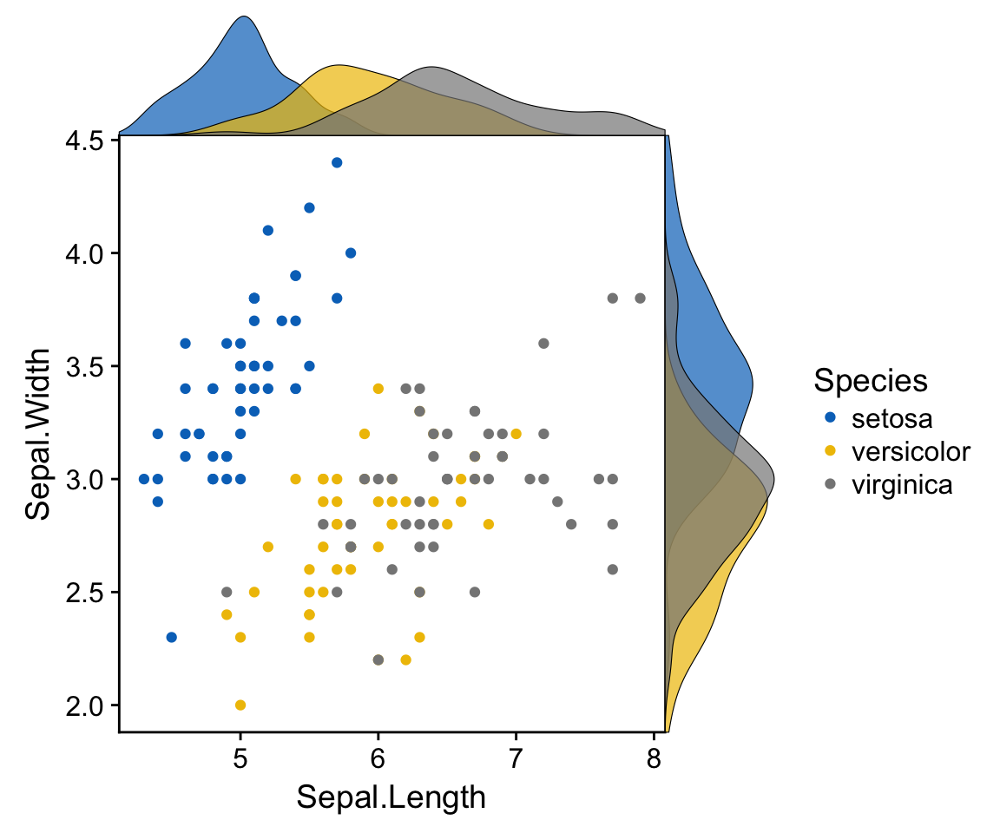

# ChartStudy---MarginalPlot

Typically, a marginal plot actually utilizes the margins of a scatterplot to provide timely and important information about the initial data [1].

## Alternative names

* Stuffed-Crust Charts : refering to the extra information given on each axis of the plot.

## Description

A marginal plot visualization adds some extra data for each dimension of the dataset. On the graph below, more information can be be given on the distribution of each attribute depending on Iris species. It allows to display useful data in addtion to a simple scatter plot, without overloading the visualization.

<table border="0">
  <tr>
    <td>
      
    </td>
  </tr>
  <tr>
    <td>
      Data visualization for Iris dataset with a marginal plot
    </td>
  </tr>
</table>

## Historical Examples

<table border="0">
  <tr>
    <td>
      
    </td>
  </tr>
  <tr>
    <td>
      Visualisation des données Iris avec espèces par couleur, et effectif par taille
    </td>
  </tr>
</table>

## Recent most famous ones

There are as many variations as there are visualization for one dimension arrays. Those visualization are histograms, Box-and-Whisker-Plots, hash lines, and so forth. Here are a few examples.

## Comments: possible variations

### Scatterplot with Marginal Histograms
Most popular type of 1-D visualization, histograms allows a quick preview of discretized spectrum of data.

<table border="0">
  <tr>
    <td>
      
    </td>
  </tr>
  <tr>
    <td>
      Scatterplot with Marginal Histograms [4]
    </td>
  </tr>
</table>

### Scatterplot with Marginal Box-and-Whisker-Plots
This gives some statistics tools to work on each dimension. It can be a good way to see if the current visualization is really covering a high percentage of the plotted data.

<table border="0">
  <tr>
    <td>
      
    </td>
  </tr>
  <tr>
    <td>
      Scatterplot with Marginal Box-and-Whisker-Plots [4]
    </td>
  </tr>
</table>

### Scatterplot with Marginal Hash Lines
It can give an extra insight about data distribution, and can then be considered as an interesting complement to Box-and-Whisker-Plots.

<table border="0">
  <tr>
    <td>
      
    </td>
  </tr>
  <tr>
    <td>
      Scatterplot with Marginal Hash Lines [4]
    </td>
  </tr>
</table>

## Sources

* [1] Using Marginal Plots, aka "Stuffed-Crust Charts" : http://blog.minitab.com/blog/data-analysis-and-quality-improvement-and-stuff/using-marginal-plots-aka-stuffed-crust-charts
* [2] Marginal Model Plots : https://support.sas.com/rnd/app/stat/papers/marginal_model_plots.pdf
* [3] Perfect Scatter Plots with Correlation and Marginal Histograms : http://www.sthda.com/english/articles/24-ggpubr-publication-ready-plots/78-perfect-scatter-plots-with-correlation-and-marginal-histograms/
* [4] Got a Scatter Plot? Learn How to Add Marginal Histograms : https://www.tableau.com/about/blog/2015/11/how-make-scatterplot-marginal-histograms-45811
